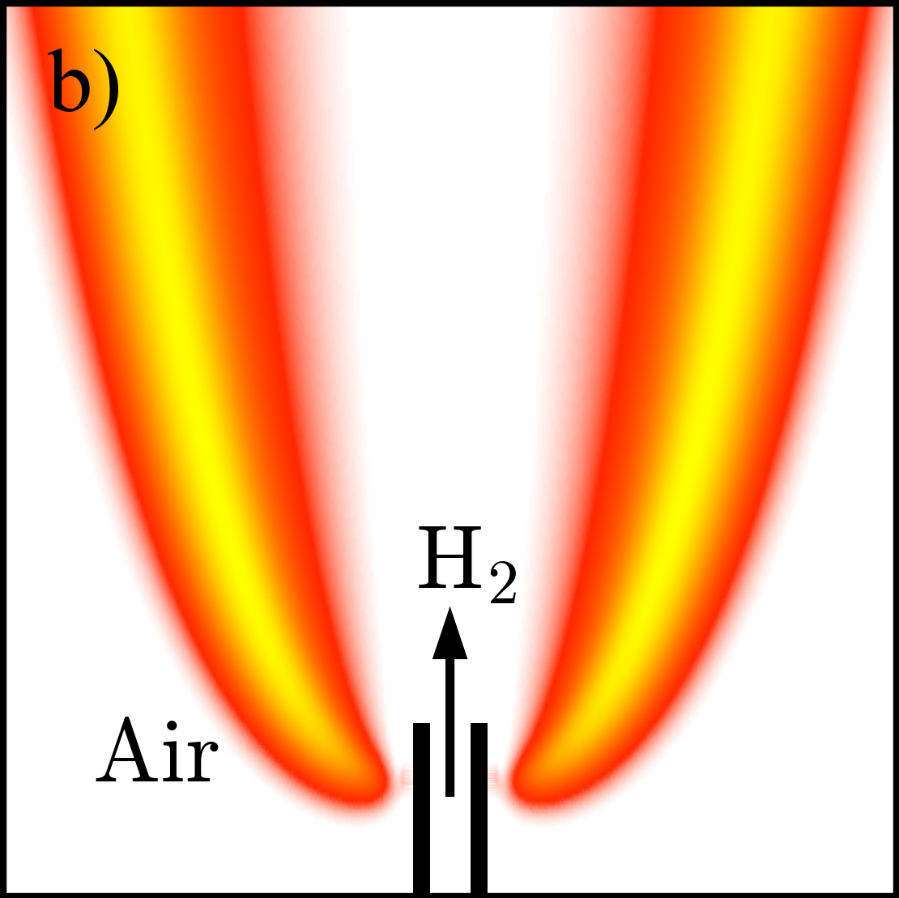
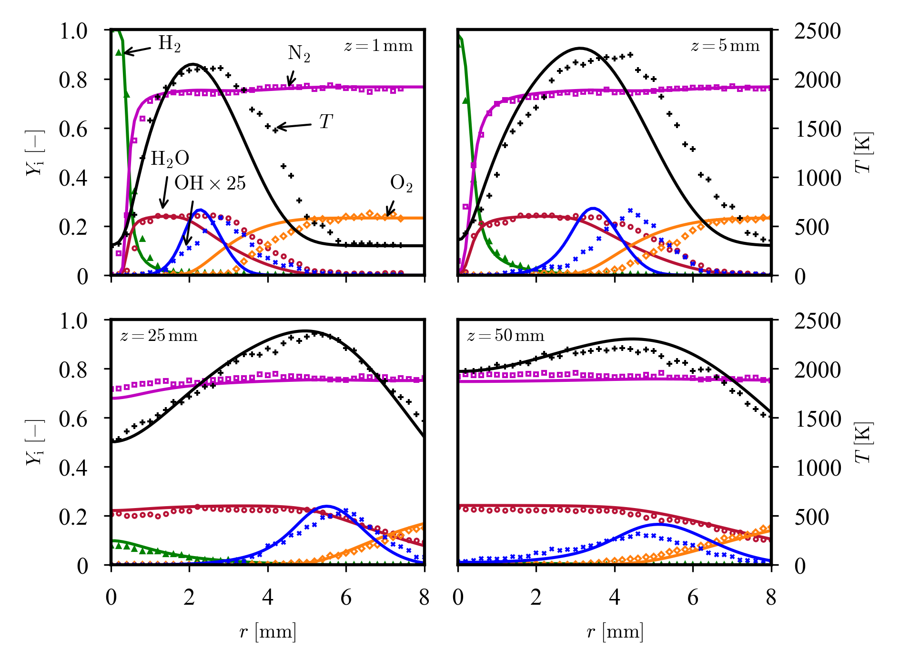
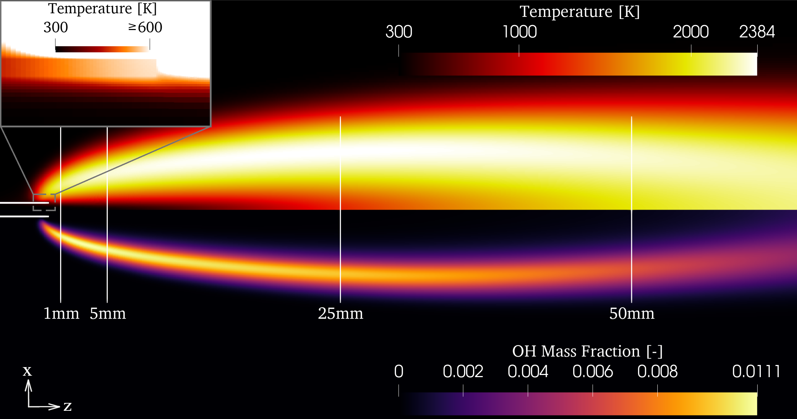

# 2D axi-symmetric laminar non-premixed jet flame

This is a 2D laminar non-premixed hydrogen jet flame demonstration of the capabilities of FickianTransportFoam [[1](#1)] and DLBFoam [[2](#2), [3](#3)].

## Case description

This case setup follows the experimental setup by Cheng et al. [[4](#4)]. Pure hydrogen jet at atmospheric pressure and room temperature is injected through a vertical steel pipe (D = 1 mm, Re = 330) in the ambient air where it forms stable diffusion jet flame after ignition. In the experiment, concentrations of O2, N2, H2O, H2, and OH were measured as well as temperatures.

<p align="center">
  
</p>

## Numerical setup

A two-dimensional wedge-type mesh is used. The solver is `chtMultiRegionFoam`, which solves the same equations as `reactingFoam` for the fluid region, and additionally solves the heat equation for the temperature of the solid region (nozzle wall). The transient approach is used to reach the steady state in the fluid region, but the solid region uses a steady-state assumption to reach the overall steady-state faster.  The flame is ignited using heatSource fvModel.

More details can be found in the manuscript or the present case setup files. 


## Execution

Simply execute  
```./Allrun```  

Note that the case setup uses manual decomposition for the nozzle wall to get a reasonable cell count per processor for the solid region, which increases the simulation performance. The `createManualDecomposition` can be used to generate `constant/nozzle/manualDecomposition` file for a given number of processors (given as an argument).


## PostProcessing/Validation

`sampleFn` function object collects the data at the experimental sampling locations. Experimental data (obtained from figures in [[4](#4)]) is located in the `validation` directory. Plots are generated using `postprocess.ipynb` Jupyter notebook.

<p align="center">
  
</p>

Additionally, here I provide pvbatch scripts, which were used to generate images from the manuscript with Paraview 5.11. You can execute them as
```
pvpython pvbatch_paper.py
pvpython pvbatch_paper_nozzleT.py
```
In the output of these commands you will find `pdfjam` commands, which will adjust the image size.

<p align="center">
  
</p>

**Total speed-up compared to standard OpenFOAM solver was around 15.**

## References
<a id="1">[1]</a> A. Haider, I. Morev, A. Rintanen, Z. Shahin, P. Tamadonfar, S. Karimkashi, A. Wehrfritz, V. Vuorinen, DLBFoam for open-source numerical simulations of hydrogen flames

<a id="2">[2]</a>  B. Tekgül,  P. Peltonen,  H. Kahila,  O. Kaario,  V. Vuorinen,  DLBFoam: An open-source dynamic load balancing model for fast reacting flow simulations in OpenFOAM, Computer Physics Communications, Volume 267, [10.1016/j.cpc.2021.108073](https://doi.org/10.1016/j.cpc.2021.108073) (2021).

<a id="3">[3]</a>  I. Morev, B. Tekgül, M. Gadalla, A. Shahanaghi, J. Kannan, S. Karimkashi, O. Kaario, V. Vuorinen, Fast reactive flow simulations using analytical Jacobian and dynamic load balancing in OpenFOAM, Physics of Fluids 34, 021801, [10.1063/5.0077437](https://doi.org/10.1063/5.0077437) (2022).

<a id="4">[4]</a> T. S. Cheng, C. Y. Wu, C. P. Chen, Y. H. Li, Y. C. Chao, T. Yuan, and T. S. Leu, “Detailed measurement and assessment of laminar hydrogen jet diffusion flames,” Combustion and Flame 146, 268–282, [10.1016/j.combustflame.2006.03.005](https://doi.org/10.1016/j.combustflame.2006.03.005) (2006).