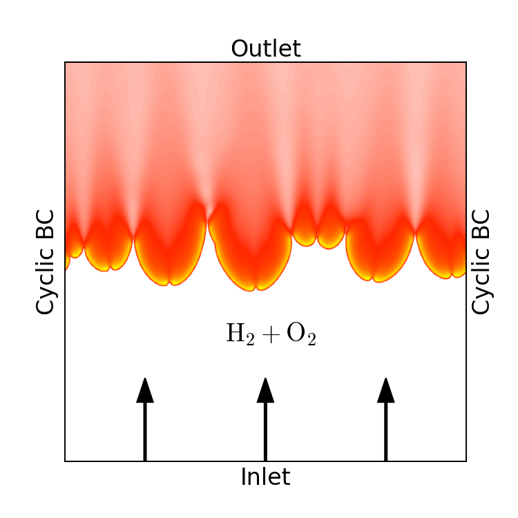
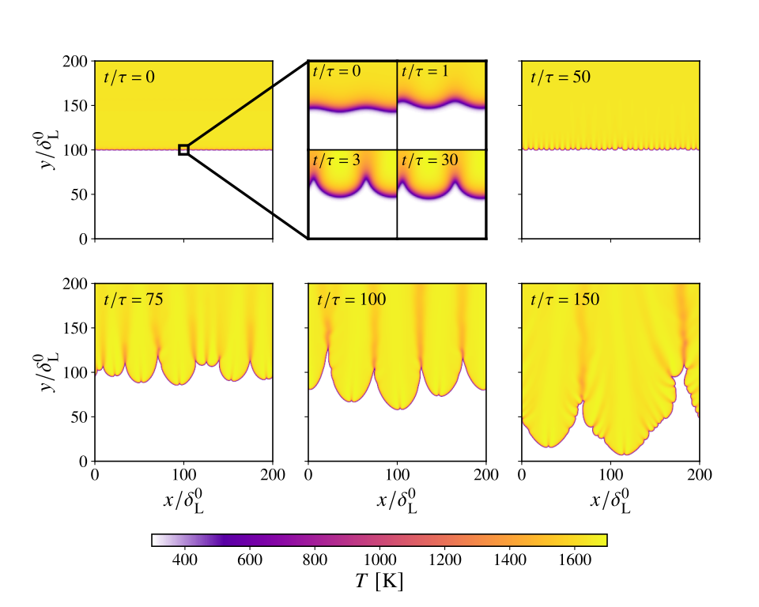

# 2D laminar freely propagating premixed flame

This is a 2D planar flame demonstrating capabilities of the FickianTransportFoam and DLBFoam, published in Ref.[[1]](#1) and Ref.[[2]](#2)

## Case description

The present 2D planar flame case setup demostrates the creation of thermodiffusive instabilities in a lean $\phi=0.5$ freely propagating premixed hydrogen planar flame. The figure below represents the numerical domain, where the flame propagates downwards against the fuel-oxidizer stream. The domain size is set to $200\times 200$ flame thicknesses. The computational grid is made fine enough so that $\Delta x=\Delta y = \delta_\mathrm{L}/10$. Periodic boundary conditions are imposed in the lateral direction. At the inflow boundary, hydrogen and air mass fractions are set to a constant value while at the exit, the zero-gradient boundary condition is set for all species. The velocity of the mixture at the input is set to an estimate of the consumption speed and is adjusted manually over the course of the simulation to keep the flame front away from the boundaries. The domain is initialized with a steady-state solution of a 1D freely propagating flame with a small spatial sinusoidal perturbation introduced in the flame front.

  

## Execution
Compile first the mechanism in the *mech* folder and run the case with *./Allrun*. The consumption speed of the flame is changing over time and is significantly larger, when the cellular structures are present. Therefore, when running more than $\approx150$ flame times, the velocity field has to be mapped in order to keep the flame inside the computational domain. 

## Postprocessing
In order to to post-process the simulation data, you can use python or Paraview to observe the development of cellular structures created by thermodiffusive instabilities.

  

**Total speed-up compared to standard OpenFOAM solver was around 8.6**

## References
<a id="1">[1]</a>
A. Haider, I. Morev, A. Rintanen, Z. Shahin, P. Tamadonfar, S. Karimkashi, A. Wehrfritz, V. Vuorinen, DLBFoam for open-source numerical simulations of
hydrogen flames

<a id="2">[2]</a> 
I. Morev, B. Tekgül, M. Gadalla, A. Shahanaghi, J. Kannan, S. Karimkashi, O. Kaario, V. Vuorinen, Fast reactive flow simulations using analytical Jacobian and dynamic load balancing in OpenFOAM, Physics of Fluids 34, 021801, [10.1063/5.0077437](https://doi.org/10.1063/5.0077437) (2022).
