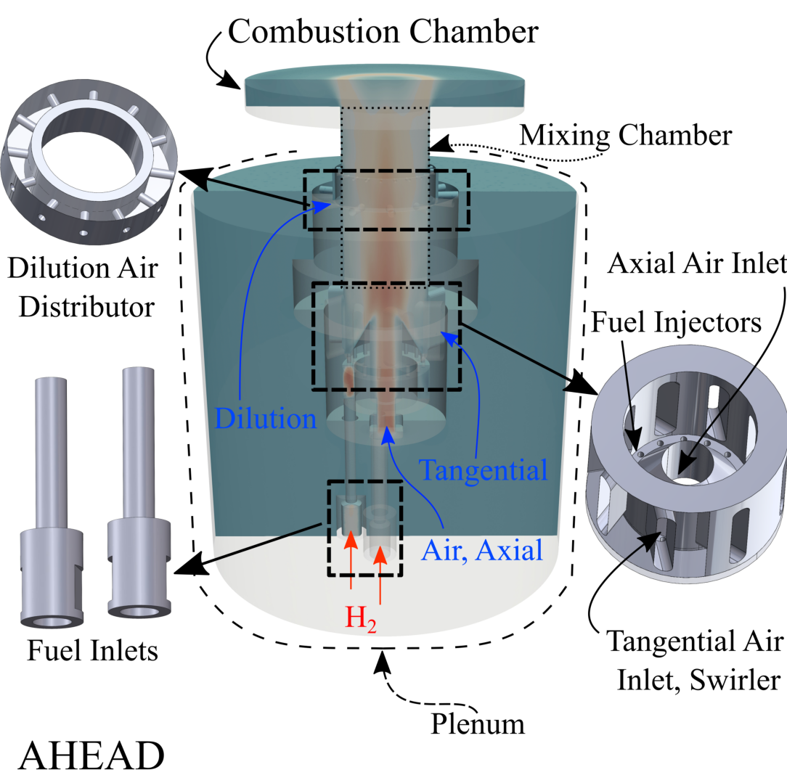
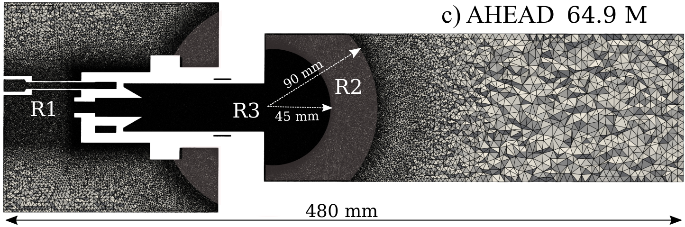
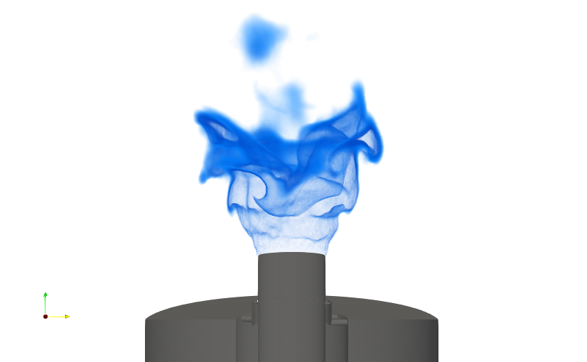
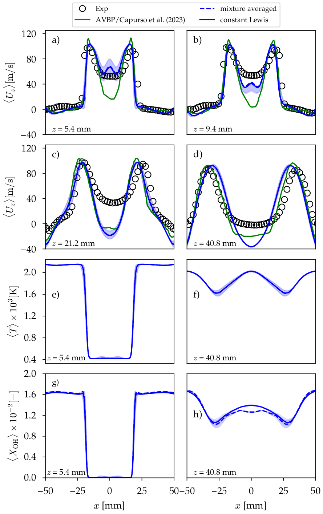

# 3D turbulent premixed flame (AHEAD)
This is a validation study of the AHEAD premixed burner carried out under stable conditions at an equivalence ratio of 0.6. The simulations were conducted using OpenFOAM with FickianTransportFoam and DLBFoam, as published in Ref.[[1]](#1) and Ref.[[2]](#2). AHEAD is a premixed swirl-stabilized burner, which is enhanced for flashback over a wide range of operating conditions, using hydrogen as fuel. The experimental work was carried out by Reichel et al. [[3]](#3). 

## Case description
Air is introduced through the plenum, from where it is subdivided into three main paths to access the cylindrical mixing chamber: 1) axial inlet, providing the axial momentum (8 mm diameter), 2) 8 radial slits, creating tangential momentum (swirl motion), and 3) 12 dilution holes, preventing boundary layer flashback. Fuel is introduced through 16 fuel inlet ports into the mixing chamber; each fuel inlet port is 0.8 mm in diameter, encircling the truncated center body at the bottom of the mixing chamber. The diameter of the mixing chamber is 34 mm. 

  

## Numerical setup

. The solver is reactingFoam, 

The simulation setup incorporates a species-specific constant Lewis number transport model to account for the fast diffusion of light hydrogen atoms. Details regarding the calculation of species-specific Lewis numbers and the conditions used in the present simulations are provided in the Supplementary Data file Section of Ref [[1]](#1) . The turbulent Schmidt number  is set to 0.75, and the turbulent Prandtl number to 0.85. To analyze the implemented transport models, six simulations are performed in total: three non-reactive flows to assess mesh independence and three reactive flows. More details can be found in the manuscript or the present case setup files in Ref [[1]](#1).

  

## Execution

## PostProcessing/Validation

  

  

**Total speed-up compared to standard OpenFOAM solver was around ?.**

## References

<a id="1">[1]</a>
A. Haider, I. Morev, A. Rintanen, Z. Shahin, P. Tamadonfar, S. Karimkashi, A. Wehrfritz, V. Vuorinen, DLBFoam for open-source numerical simulations of hydrogen flames

<a id="2">[2]</a> 
I. Morev, B. Tekgül, M. Gadalla, A. Shahanaghi, J. Kannan, S. Karimkashi, O. Kaario, V. Vuorinen, Fast reactive flow simulations using analytical Jacobian and dynamic load balancing in OpenFOAM, Physics of Fluids 34, 021801, [10.1063/5.0077437](https://doi.org/10.1063/5.0077437) (2022).

<a id="3">[3]</a>
T. G. Reichel, C. O. Paschereit, Interaction mechanisms of fuel momentum with flashback limits in lean-premixed combustion of hydrogen [10.1016/j.ijhydene.2016.11.018](https://doi.org/10.1016/j.ijhydene.2016.11.018) 

