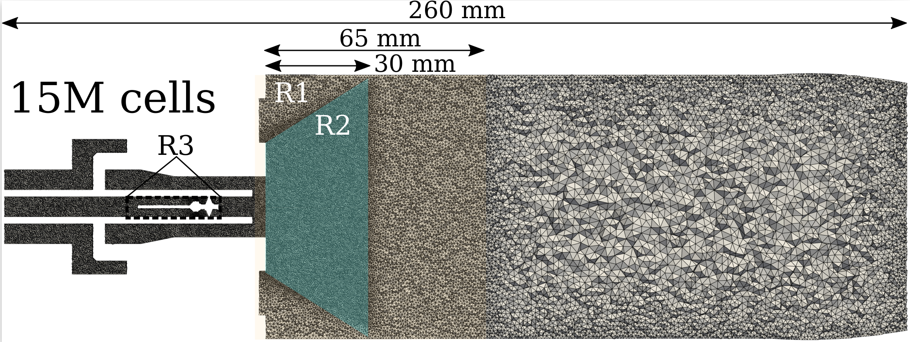

# 3D turbulent non-premixed flame (HYLON, Flame A)
This is one of the turbulent hydrogen flames proposed in the clean aviation workshop and presented in the TNF workshop Ref.[[1]](#1)Ref.[[2]](#2). The case flame demonstrating capabilities of the FickianTransportFoam and DLBFoam, published in Ref.[[3]](#3) and [[4]](#4). 

## Case description
The case represents an anchored swirling turbulent flame. The details of the experimental setup can be found in the work by Aneallo et al.Ref.[[5]](#5).

  

## Numerical setup
The details of the numerical setup can be found in our publication Ref.[[3]](#3).

  

## Execution
Compile first the mechanism in the *mech* folder and run the case with *./Allrun*. Download the latest time step that contains all the species data from the provided link if needed.

## PostProcessing/Validation
To post-process the simulation data, you can use Python or Paraview to visualize the flame. For sampling, two sampling dictionaries are provided in the system folder that can be used for plotting the experimental data over a line at different axial heights.

  

The cold flow validation is shown in the figure below. For the reacting flow validation please check the paper.

  

**Total speed-up compared to standard OpenFOAM solver was around 13.

## References

<a id="1">[1]</a>
https://www.clean-aviation.eu/media/news/launch-of-clean-aviations-working-group-on-validation-of-hydrogen-flame-numerical-simulations

<a id="2">[2]</a> 
https://tnfworkshop.org/hydrogen-flames/

<a id="3">[3]</a>
A. Haider, I. Morev, A. Rintanen, Z. Shahin, P. Tamadonfar, S. Karimkashi, A. Wehrfritz, V. Vuorinen, DLBFoam for open-source numerical simulations of
hydrogen flames

<a id="4">[4]</a>
I. Morev, B. Tekgül, M. Gadalla, A. Shahanaghi, J. Kannan, S. Karimkashi, O. Kaario, V. Vuorinen, Fast reactive flow simulations using analytical Jacobian and dynamic load balancing in OpenFOAM, Physics of Fluids 34, 021801, [10.1063/5.0077437](https://doi.org/10.1063/5.0077437) (2022)

<a id="5">[5]</a>
A. Aniello, D. Laera, S. Marragou, H. Magnes, L. Selle, T. Schuller,
and T. Poinsot, “Experimental and numerical investigation of two flame
stabilization regimes observed in a dual swirl H2-air coaxial injector,”
Combustion and Flame, vol. 249, p. 112595, Mar. (2023)
